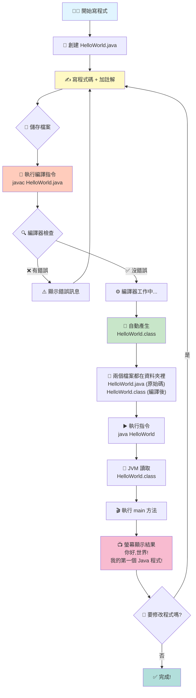
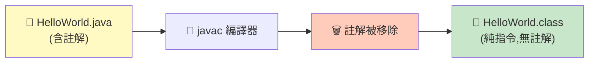

# 🎓 HelloWorld 程式說明

## 📝 程式碼

[01_HelloWorld.java](file:///c:/Users/gino.huang/Desktop/java/01_HelloWorld.java)

```java
// 這是一個「類別」的宣告
// public = 公開的,任何人都可以使用
// class = 類別關鍵字
// HelloWorld = 類別名稱 (必須和檔案名稱 HelloWorld.java 一樣!)
public class HelloWorld {

    // 這是「主方法」,程式的起點
    // public = 公開的
    // static = 靜態的 (不需要建立物件就能執行)
    // void = 沒有回傳值
    // main = 方法名稱 (固定的,Java 會找這個方法來執行)
    // String[] args = 參數,可以接收命令列輸入的文字
    public static void main(String[] args) {

        // System.out.println = 在螢幕上印出一行文字
        // System = Java 的系統類別
        // out = 輸出物件
        // println = print line 的縮寫,印一行後會自動換行
        // 雙引號裡面的文字會被顯示出來
        System.out.println("你好,世界!");

        // 再印出另一行文字
        System.out.println("我的第一個 Java 程式!");

    } // main 方法結束

} // HelloWorld 類別結束
```

---

## 📊 完整流程圖

### 從寫程式到執行的完整過程



---

## 🗑️ 註解的處理過程



> [!IMPORTANT] > **重點:** `.class` 檔案是執行 `javac` 時**自動產生**的,你不需要手動創建!註解會在編譯時被移除,不會進入 `.class` 檔案。

---

## 🎯 編譯流程詳細說明

### `.class` 檔案是自動產生的!

當你執行:

```bash
javac 01_HelloWorld.java
```

**編譯器會自動:**

1. ✅ 讀取 `01_HelloWorld.java`
2. ✅ 檢查語法是否正確
3. ✅ 移除所有註解
4. ✅ 翻譯成位元碼
5. ✅ **自動創建** `01_HelloWorld.class` 檔案
6. ✅ 把編譯結果寫入 `.class` 檔案

**你不需要:**

- ❌ 手動創建 `.class` 檔案
- ❌ 指定輸出檔名
- ❌ 做任何額外設定

### 📋 詳細步驟對照表

| 步驟 | 你做的事                        | 電腦做的事            | 檔案狀態              |
| ---- | ------------------------------- | --------------------- | --------------------- |
| 1    | 寫程式碼                        | -                     | 只有 `.java`          |
| 2    | 加註解                          | -                     | 只有 `.java`          |
| 3    | 儲存檔案                        | -                     | 只有 `.java`          |
| 4    | 執行 `javac 01_HelloWorld.java` | 開始編譯              | 只有 `.java`          |
| 5    | 等待                            | 檢查語法              | 只有 `.java`          |
| 6    | 等待                            | 移除註解              | 只有 `.java`          |
| 7    | 等待                            | 翻譯成位元碼          | 只有 `.java`          |
| 8    | 等待                            | **自動創建 `.class`** | ✅ `.java` + `.class` |
| 9    | 執行 `java 01_HelloWorld`       | 執行程式              | `.java` + `.class`    |
| 10   | 看結果                          | 顯示輸出              | `.java` + `.class`    |

### 🔬 註解在編譯過程中的變化

**編譯前 (01_HelloWorld.java):**

```java
// 這是註解,說明這是主方法
public static void main(String[] args) {
    System.out.println("你好,世界!");  // 印出文字
}
```

**編譯後 (01_HelloWorld.class 的概念):**

```
[二進位位元碼]
01001010 01000001 01010110 01000001...
(沒有註解,只有指令)
```

**註解的命運:**

- ✅ 幫助你理解程式碼
- ✅ 存在於 `.java` 原始碼中
- ❌ 編譯時被丟棄
- ❌ 不會進入 `.class` 檔案
- ❌ 不會影響程式執行速度

---

## 🔄 如何編譯和執行

### 步驟 1: 編譯

```bash
javac 01_HelloWorld.java
```

- 會自動產生 `01_HelloWorld.class` 檔案

### 步驟 2: 執行

```bash
java 01_HelloWorld
```

- 注意:不要加 `.class` 副檔名!

### 輸出結果

```
你好,世界!
我的第一個 Java 程式!
```

---

## 📂 檔案說明

| 檔案                  | 說明                        | 大小        |
| --------------------- | --------------------------- | ----------- |
| `01_HelloWorld.java`  | 原始碼 (人類看得懂,有註解)  | 1,049 bytes |
| `01_HelloWorld.class` | 編譯後的位元碼 (電腦執行用) | 474 bytes   |

---

## 💡 重要概念

### `.java` vs `.class`

| 特性         | `.java`  | `.class`        |
| ------------ | -------- | --------------- |
| **給誰看**   | 👨‍💻 人類  | 🤖 電腦         |
| **可以編輯** | ✅ 是    | ❌ 否           |
| **可以執行** | ❌ 否    | ✅ 是           |
| **可以刪除** | ❌ 不行! | ✅ 可以重新編譯 |
| **檔案類型** | 文字檔   | 二進位檔        |

### 關鍵字說明

- **`public`** - 公開的,任何人都可以使用
- **`class`** - 類別,Java 程式的基本單位
- **`static`** - 靜態的,不需要建立物件就能執行
- **`void`** - 沒有回傳值
- **`main`** - 主方法,程式的起點
- **`String[] args`** - 命令列參數

---

## 🎯 練習建議

1. **修改輸出文字** - 改成你想說的話
2. **加更多輸出** - 多加幾行 `System.out.println(...)`
3. **觀察編譯過程** - 刪除 `.class` 後重新編譯,看它自動產生

---

## ❓ 常見問題

**Q: 為什麼檔名要和類別名稱一樣?**  
A: Java 的規定,`public class 01_HelloWorld` 必須存在 `01_HelloWorld.java` 檔案中。

**Q: 註解會讓程式變慢嗎?**  
A: 不會!註解在編譯時就被移除了。

**Q: 可以只有 `.class` 沒有 `.java` 嗎?**  
A: 可以執行,但無法修改程式碼。

**Q: 如果編譯出錯怎麼辦?**  
A: 仔細看錯誤訊息,通常會告訴你哪一行有問題。
